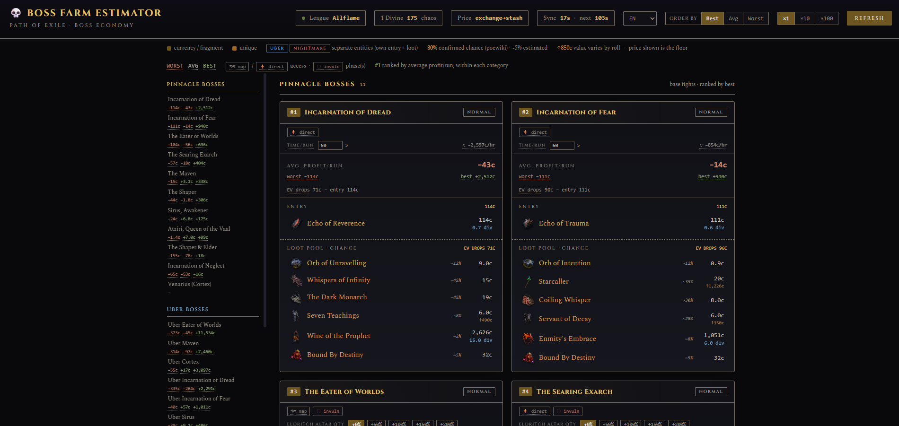

# 💀 Boss Farm Estimator

A single-file, zero-dependency web dashboard that estimates farming profitability for **Path of Exile 1** pinnacle, Uber, and Tier 17 Nightmare-map bosses — live prices, real drop-chance sourcing where it exists, and an honest worst/average/best range instead of one misleading number.

> **Unofficial fan tool.** Not affiliated with or endorsed by Grinding Gear Games. Prices come from [poe.ninja](https://poe.ninja) / [poe.watch](https://poe.watch), drop data from [poewiki.net](https://www.poewiki.net) and community guides.



## Why this exists

Most "which boss should I farm" answers collapse everything into a single expected-value number. That number is real, but it's also not what any *one* run looks like — most kills return nothing from the loot pool and you just eat the entry cost, and occasionally one item pays for the next fifty runs. This tool shows all three: the **worst** case (nothing drops), the **average** (EV across many runs), and the **best** case (the single most valuable item in the pool drops — not the whole pool at once, since several bosses can only ever yield one of a handful of items per kill).

## Quick start

```bash
python boss.py
# or customize:
python boss.py --league Standard --port 8000 --poll 120
```

No `pip install` — it's stdlib Python 3 only. Opens `http://localhost:8000` in your browser automatically. `--poll` sets the browser's auto-refresh interval in seconds; prices are cached server-side for 5 minutes regardless.

## Deploying a static version (GitHub Pages)

`boss.py` needs a running Python process because poe.ninja sends no CORS header, so a browser
can't call it directly from a static-hosted page — `boss.py`'s server proxies it. To publish a
no-backend build (GitHub Pages or any static host), a small Cloudflare Worker fills the same
CORS-proxy role, and the pricing math moves into client-side JS instead of running server-side.

1. **Deploy the proxy** (one-time, needs a free [Cloudflare](https://dash.cloudflare.com/sign-up)
   account and the [`wrangler`](https://developers.cloudflare.com/workers/wrangler/) CLI):
   ```bash
   cd worker
   wrangler deploy
   ```
   This prints your Worker's URL, e.g. `https://boss-farm-proxy.<you>.workers.dev`.

2. **Generate the static page** — `ENTITIES` in `boss.py` stays the single source of truth;
   this reads it directly and embeds it, it isn't duplicated anywhere:
   ```bash
   python build_static.py --worker-url https://boss-farm-proxy.<you>.workers.dev
   # optional: --league Standard --poll 120 --out docs
   ```
   This writes `docs/index.html` (plus `docs/.nojekyll`).

3. **Commit and push** `docs/`, then in the repo's GitHub settings: **Settings → Pages →
   Deploy from a branch → `main` / `/docs`**.

Re-run step 2 (and re-push) whenever `ENTITIES` changes — there's no CI/auto-rebuild, this is a
manual regenerate step by design.

## Features

- **27 boss encounters** across three independently-ranked categories:
  - **Pinnacle** — Shaper, Elder, Sirus, Maven, Searing Exarch, Eater of Worlds, Venarius (Cortex), Atziri, and the three Secrets-of-the-Atlas Incarnations (Fear/Dread/Neglect)
  - **Uber** — the Uber Pinnacle version of every fight above (4-fragment entry)
  - **Nightmare** — all 5 Tier 17 Nightmare map bosses (Abomination, Citadel, Fortress, Sanctuary, Ziggurat)
- **Worst / average / best profit range** per boss, not a single collapsed number — see [why this exists](#why-this-exists).
- **Sortable rankings** — order each category by worst, average, or best (default: best).
- **×1 / ×10 / ×100 run multiplier** — see totals over multiple runs instead of one, recalculated instantly from already-loaded data.
- **Adjustable quantity controls** on fights where loot scales with a player choice instead of a fixed rate: Eldritch Altars (normal Searing Exarch / Eater of Worlds only) and map IIQ (all 5 Nightmare maps).
- **Editable time-per-run + live ≈chaos/hour rate** — GGG doesn't publish kill times any more than they publish drop rates, so this is a plain input with sensible defaults (60s direct-spawn, 120s if you have to navigate to the boss), not a guess baked into the code.
- **Access-type and invulnerability-phase badges** (🗺️ map-navigation required / ⚡ direct spawn, 🛡️ has an invulnerable phase) — shown only where actually verified, never a guessed default.
- **Realistic pricing, not lucky-roll fantasy numbers**: for items whose value depends on a random roll (corrupted-implicit weapons, jewel affix combos), the EV uses the realistic floor price — [poe.watch](https://poe.watch)'s dedicated "Unidentified" price when published, otherwise the lowest of poe.ninja's per-roll listings — with the identified ceiling shown separately (`↑850c`) rather than baked into the average.
- **EN / PT-BR UI**, dropdown in the header. Only interface labels and explanations translate — boss names, item names, and every number are exactly what poe.ninja/poe.watch/poewiki report, in either language.
- **Rich hover explanations** on every stat and control — not a one-line browser tooltip, an actual explanation of the mechanic and the math behind the number.
- Left sidebar with a live-updating summary of every boss's worst/avg/best, click to jump straight to its card.

## How it works

One Python file (`boss.py`, stdlib only — `http.server`, `urllib`, `concurrent.futures`, no `pip install`):

1. **`ENTITIES`** — the hand-maintained boss/drop data: entry cost, loot pool with chances, and metadata (access type, invulnerability mechanic, whether quantity can be boosted). See the schema comment directly above it in the source.
2. **`build_index()`** — fetches live prices from poe.ninja (Exchange + Stash feeds for currency/fragments, Item feed for uniques/maps/invitations) and poe.watch (for the "Unidentified" price case), all in parallel via a thread pool.
3. **`build_payload()`** — resolves every entry/drop against live prices and computes the worst/average/best profit numbers per boss.
4. A single embedded HTML page (inline CSS + vanilla JS, no build step, no framework) renders it and polls `/api/data` on the interval you set.

## Data sources

| Source | Used for |
|---|---|
| [poe.ninja](https://poe.ninja/poe1/economy) | Live currency/fragment/unique prices |
| [poe.watch](https://poe.watch) | "Unidentified" floor price for roll-dependent uniques (e.g. [Watcher's Eye](https://poe.watch/detailed/159)) |
| [poewiki.net](https://www.poewiki.net) | Drop chances where officially documented (e.g. [The Eater of Worlds](https://www.poewiki.net/wiki/The_Eater_of_Worlds)), and every boss card links to its wiki page for verification |
| [poedb.tw](https://poedb.tw/us/) | Cross-checking boss mechanics and item sources |
| [maxroll.gg](https://maxroll.gg/poe) | Boss guides, drop pool cross-referencing |

Example: [Uber Atziri's card links to poewiki](https://www.poewiki.net/wiki/Uber_Atziri); its drops link to their live [poe.ninja unique-weapons](https://poe.ninja/poe1/economy/allflame/unique-weapons) / [unique-armours](https://poe.ninja/poe1/economy/allflame/unique-armours) listings.

## A note on accuracy

GGG does not publish official drop rates, kill times, or exact quantity-scaling formulas for any of this content. Every `"est"`-tagged chance in `ENTITIES` is a curated estimate, not an official number — `"wiki"`-tagged chances (currently: Eater of Worlds) come from a real published sample size on poewiki. This tool has gone through several correction passes (see `CLAUDE.md` for the full history) catching real errors: wrong item-to-boss attribution, misspelled names, wrong item types, and missing chase uniques — all fixed only after confirming the item exists as a real, currently-traded price on poe.ninja, never guessed. If you spot something wrong, it's a config change away: edit the 4-5 fields of the relevant line in `ENTITIES`.

## Author

Built by **Erick Lúcio** — [linkedin.com/in/erick-lucioo](https://www.linkedin.com/in/erick-lucioo/)
